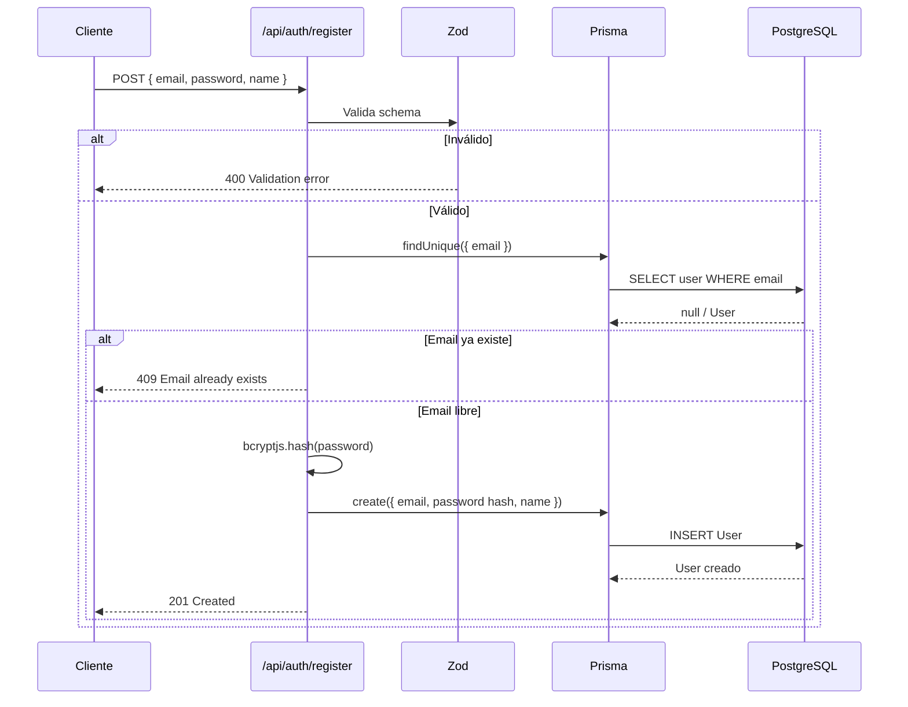
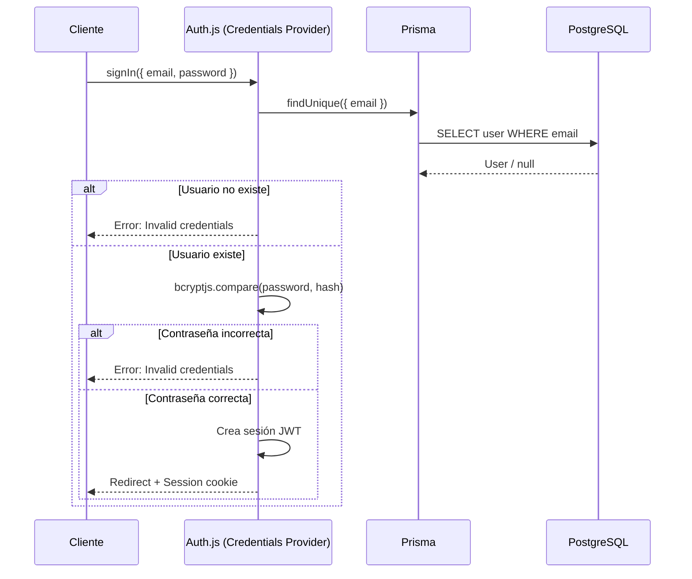

# Arquitectura — Flujo de Autenticación

> ⚠️ **Documento en construcción.** La implementación de `src/lib/auth.ts` está pendiente.
> Este documento se completará cuando EP-01 esté implementado.

---

## Stack de autenticación

| Librería | Versión | Rol |
|---------|---------|-----|
| Auth.js (NextAuth) | 5.0.0-beta.29 | Sesiones y providers |
| bcryptjs | 3.0.3 | Hash de contraseñas |
| Zod | 4.4.3 | Validación de inputs |
| Prisma | 7.8.0 | Persistencia de usuarios |

---

## Flujo planeado

### Registro



### Login



---

## Protección de rutas

La protección se implementa mediante middleware de Next.js que verifica la sesión de Auth.js antes de permitir el acceso a las rutas del grupo `(dashboard)`.

```
Rutas públicas:  /login, /register
Rutas protegidas: /dashboard, /habits, /stats (pendientes)
```

---

## Archivos relevantes

| Archivo | Descripción |
|---------|-------------|
| `src/lib/auth.ts` | Configuración de Auth.js — providers, callbacks, session |
| `src/lib/validations.ts` | Schemas Zod para registro y login |
| `src/app/api/auth/[...nextauth]/route.ts` | Handler HTTP de Auth.js |
| `src/app/(auth)/login/page.tsx` | Página de login |
| `src/app/(auth)/register/page.tsx` | Página de registro |
