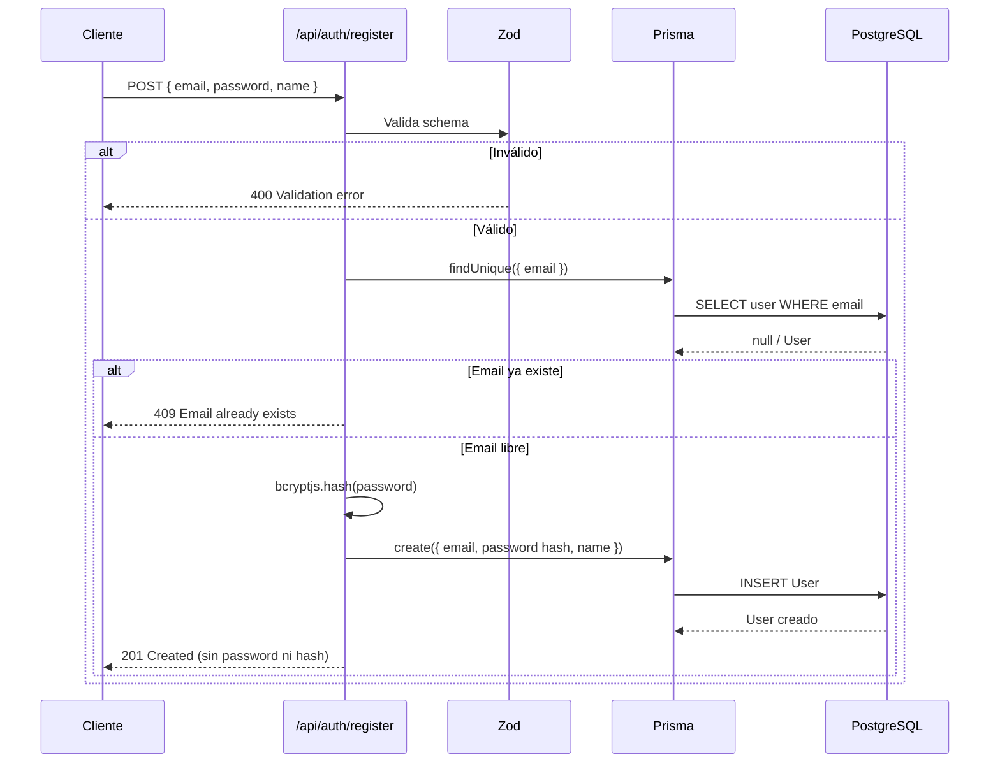

# Arquitectura — Flujo de Autenticación

> **Estado 2026-10-06: etapa de autenticación HU-02 aceptada localmente.** HU-01 tuvo aceptación local (2026-10-05), fue integrado y desplegado; la comprobación en producción fue solo lectura de páginas, no login/registro funcional. HU-02 añade política de bloqueo, sesión nativa explícita y guard servidor con 51 pruebas deterministas; A1 PostgreSQL local y A2 Chrome real pasaron sobre `a7bb421`, sin acreditar aceptación en producción. [Plan HU-02](../../_bmad-output/initiative-habitmaxxing-mvp/plan-hu-02-login.md) / [evidencia HU-01](../../_bmad-output/initiative-habitmaxxing-mvp/plan-hu-01-account-registration.md#acceptance-outcome--2026-10-05).

---

## Stack de autenticación

| Librería | Versión | Rol |
|---------|---------|-----|
| Auth.js (NextAuth) | 5.0.0-beta.29 | Sesiones y providers |
| bcryptjs | 3.0.3 | Hash de contraseñas |
| Zod | 4.4.3 | Validación de inputs |
| Prisma | 7.8.0 | Persistencia de usuarios |

---

## Flujo de referencia

### Registro

```mermaid
sequenceDiagram
    participant Cliente
    participant API as /api/auth/register
    participant Zod
    participant Prisma
    participant DB as PostgreSQL

    Cliente->>API: POST { email, password, name }
    API->>Zod: Valida schema
    alt Inválido
        Zod-->>Cliente: 400 Validation error
    else Válido
        API->>Prisma: findUnique({ email })
        Prisma->>DB: SELECT user WHERE email
        DB-->>Prisma: null / User
        alt Email ya existe
            API-->>Cliente: 409 Email already exists
        else Email libre
            API->>API: bcryptjs.hash(password)
            API->>Prisma: create({ email, password hash, name })
            Prisma->>DB: INSERT User
            DB-->>Prisma: User creado
            API-->>Cliente: 201 Created (sin password ni hash)
        end
    end
```

### Login

```mermaid
sequenceDiagram
    participant Cliente
    participant AuthJS as Auth.js (Credentials Provider)
    participant Prisma
    participant DB as PostgreSQL

    Cliente->>AuthJS: signIn({ email, password })
    AuthJS->>AuthJS: loginSchema antes de DB
    AuthJS->>Prisma: transacción Serializable: lectura y comparación
    Prisma->>DB: SELECT user WHERE email
    DB-->>Prisma: User / null
    alt Usuario no existe o bloqueo activo
        AuthJS-->>Cliente: Credenciales incorrectas
    else Usuario existe
        AuthJS->>AuthJS: bcryptjs.compare(password, hash)
        alt Contraseña incorrecta
            AuthJS->>Prisma: confirma fallo; quinto fija bloqueo de 15 min
            AuthJS-->>Cliente: Credenciales incorrectas
        else Contraseña correcta
            AuthJS->>Prisma: reinicia contador y bloqueo
            AuthJS->>AuthJS: Crea sesión JWT nativa de 30 días
            AuthJS-->>Cliente: Redirect + Session cookie
        end
    end
```

---

## Límites de autenticación y autorización

`POST /api/auth/register` es un Route Handler público y es responsable de validar y normalizar los datos, hashear la contraseña, persistir la cuenta y tratar de forma segura el email duplicado. Auth.js Credentials verifica las credenciales y establece la sesión mínima requerida por el registro para intentar el inicio automático; Credentials no crea ni persiste usuarios.

En Next.js 16, `proxy.ts` puede realizar redirecciones tempranas y generales hacia o desde rutas de autenticación según la presencia de sesión, pero se reserva como optimización: la documentación de Next.js recomienda Proxy solo como último recurso. Cada Route Handler, Server Action y acceso de servidor a datos protegidos debe volver a autenticar y autorizar en su propio límite antes de leer o modificar datos. No confiar en la redirección de Proxy como control de acceso. [Next.js Proxy](https://nextjs.org/docs/app/api-reference/file-conventions/proxy), [Auth.js Credentials](https://authjs.dev/getting-started/authentication/credentials).

- Rutas públicas implementadas: `POST /api/auth/register`, `/login`, `/register`.
- `/dashboard`: `auth()` en el Server Component exige ID de usuario válido antes de devolver contenido; sin identidad redirige a `/login`, errores de autenticación se propagan sin contenido protegido. No hay un segundo guard de Proxy implementado.
- HU-03 integra el control de logout únicamente después de este guard; conserva el placeholder sin hábitos. Cada futuro límite de datos debe autenticar y autorizar al usuario de nuevo. Etapa logout/dashboard aceptada localmente sobre `201ce13` (fuente `689cbb8`), sin acreditar producción.

---

## Política HU-02 y límites de prueba

El quinto fallo admitido establece un bloqueo interno de 15 minutos; intentos durante el bloqueo no lo extienden ni crean sesiones. En `now >= lockedUntil` se inicia una secuencia nueva y un éxito desbloqueado reinicia ambos campos. La transacción devuelve rechazo para confirmar incrementos; hasta tres intentos reintentan solo conflictos P2034 reales y otros errores fallan cerrados. Bcrypt puede retener una conexión: A1 local observó concurrencia real y seis conflictos P2034 recuperados; no se observó agotamiento de reintentos ni se midió carga de producción.

Email desconocido, contraseña errónea y bloqueo comparten "Credenciales incorrectas". Transporte exclusivo de Auth.js: no wrapper login, JWT manual, refresh-token paralelo ni HTTP 429 específico de cuenta. El cliente exige `result?.ok && !result.error`; HTTP 200 no demuestra sesión.

Auth.js usa `session.maxAge = 2_592_000` para JWT/cookie con expiración renovable al acceder a sesión. No devuelve contraseña/hash/contadores; bloqueo no revoca JWT existentes. A2 local verificó sesión, HttpOnly/SameSite=Lax, reinicio real de Chrome con el mismo perfil y acceso protegido. Secure=false en HTTP local no acredita producción. Etapa A aceptada localmente; etapa B hábitos/HU-06 no implementada, CA-01 completo pendiente.

## Logout HU-03: etapa aceptada localmente

`LogoutButton` llama a `signOut({ redirect: false, redirectTo: "/login" })`; Auth.js obtiene CSRF, envía formulario al signout nativo y procesa JSON. No hay endpoint logout propio ni borrado manual de cookies. Luego un GET al endpoint nativo de sesión, sin caché y con redirecciones rechazadas, exige HTTP exitoso y JSON `null` explícito antes de navegar al login. Un helper resuelto o llegar al login no demuestra sesión terminada; un resultado ambiguo restaura reintento y aviso neutral, sin éxito supuesto.

PM-01–PM-03 (2026-10-07): alcance de este navegador, sin revocar JWT copiados/otros dispositivos; etapa logout/dashboard aceptada con tres intentos aislados sobre `201ce13` (fuente `689cbb8`): cookie retirada, sesión 200/null, dashboard 307/login directo/Back, repetición sin sesión, teclado y 320 px. Confirmación 503 mostró aviso neutral y reintento sin éxito supuesto; el reintento real confirmó sesión nula. Aserciones iniciales de callback/localizador fueron límites del harness; origen del callback repetido desconocido. API hábitos diferida a HU-06 e historia completa pendiente; HTTP local no acredita Secure en producción ni aprobación de seguridad. Temporales retenidos por política requieren seguimiento, con contenedores/volúmenes/procesos ya detenidos.

## Límite de creación HU06-01

`POST /api/habits` autentica con `auth()` y verifica que la cuenta aún exista mediante consulta de `id` antes de validar la solicitud. Los callbacks JWT actuales no realizan esa comprobación. La inserción deriva `userId` exclusivamente de la identidad verificada y selecciona/proyecta solo campos escalares del hábito.

La mutación exige `Origin` exacto frente al `APP_ORIGIN` del servidor, JSON y un cuerpo leído con límite real de 8 KiB. La protección CSRF del logout nativo de Auth.js no acredita protección de este endpoint: este aplica su propio control de origen. Todos sus resultados son privados y sin caché. No se modifican políticas de login, registro, expiración ni revocación de tokens.

Las referencias anteriores a falta de publicación de HU-03 son evidencia histórica. Según el contexto proporcionado por el usuario, HU-03 local logout/dashboard fue integrado y desplegado en `468a57ce3e5ad57000c2b8dd65e682e2ba946080`; no se volvió a comprobar producción en esta unidad. La prueba real de GET hábitos tras logout permanece pendiente hasta implementar el catálogo y autorizar su aceptación. No se infiere aprobación de seguridad.

## Archivos relevantes

| Archivo | Descripción |
|---------|-------------|
| `src/lib/auth.ts` | Configuración de Auth.js — providers, callbacks, session |
| `src/lib/login-policy.ts` | Decisión serializada de bloqueo y reinicio |
| `src/app/(dashboard)/dashboard/page.tsx` | Guard servidor HU-02 e integración del control HU-03 |
| `src/app/(dashboard)/dashboard/logout-button.tsx` | Logout nativo confirmado y reintento neutral |
| `src/lib/validations.ts` | Schemas Zod para registro y login |
| `src/app/api/auth/[...nextauth]/route.ts` | Handler HTTP de Auth.js |
| `src/app/(auth)/login/page.tsx` | Página de login |
| `src/app/(auth)/register/page.tsx` | Página de registro |
