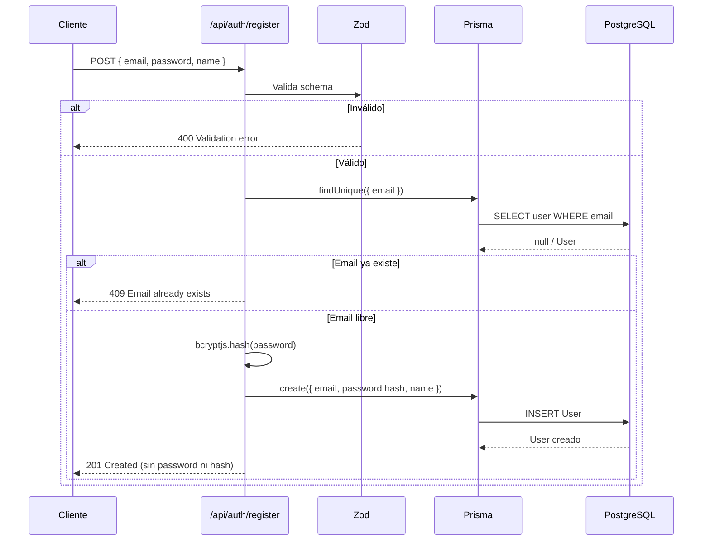
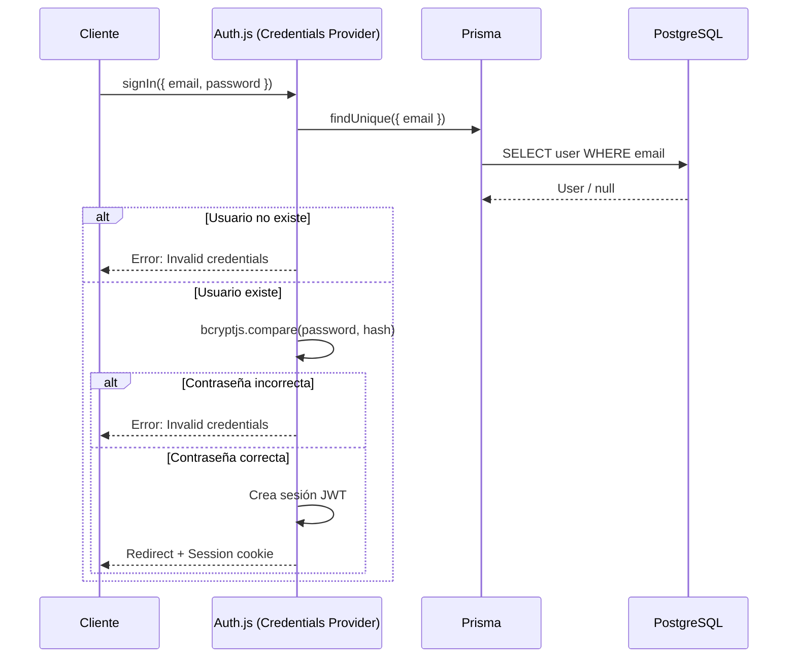

# Arquitectura — Flujo de Autenticación

> **Estado: arquitectura planeada, no implementada.** Los flujos y límites siguientes describen el diseño objetivo de HU-01; no implican que el endpoint, Auth.js ni la protección estén desplegados. `src/lib/auth.ts` está pendiente.

---

## Stack de autenticación

| Librería | Versión | Rol |
|---------|---------|-----|
| Auth.js (NextAuth) | 5.0.0-beta.29 | Sesiones y providers |
| bcryptjs | 3.0.3 | Hash de contraseñas |
| Zod | 4.4.3 | Validación de inputs |
| Prisma | 7.8.0 | Persistencia de usuarios |

---

## Flujo planeado

### Registro


```mermaid
sequenceDiagram
    participant Cliente
    participant API as /api/auth/register
    participant Zod
    participant Prisma
    participant DB as PostgreSQL

    Cliente->>API: POST { email, password, name }
    API->>Zod: Valida schema
    alt Inválido
        Zod-->>Cliente: 400 Validation error
    else Válido
        API->>Prisma: findUnique({ email })
        Prisma->>DB: SELECT user WHERE email
        DB-->>Prisma: null / User
        alt Email ya existe
            API-->>Cliente: 409 Email already exists
        else Email libre
            API->>API: bcryptjs.hash(password)
            API->>Prisma: create({ email, password hash, name })
            Prisma->>DB: INSERT User
            DB-->>Prisma: User creado
            API-->>Cliente: 201 Created (sin password ni hash)
        end
    end
```

### Login


```mermaid
sequenceDiagram
    participant Cliente
    participant AuthJS as Auth.js (Credentials Provider)
    participant Prisma
    participant DB as PostgreSQL

    Cliente->>AuthJS: signIn({ email, password })
    AuthJS->>Prisma: findUnique({ email })
    Prisma->>DB: SELECT user WHERE email
    DB-->>Prisma: User / null
    alt Usuario no existe
        AuthJS-->>Cliente: Error: Invalid credentials
    else Usuario existe
        AuthJS->>AuthJS: bcryptjs.compare(password, hash)
        alt Contraseña incorrecta
            AuthJS-->>Cliente: Error: Invalid credentials
        else Contraseña correcta
            AuthJS->>AuthJS: Crea sesión JWT
            AuthJS-->>Cliente: Redirect + Session cookie
        end
    end
```

---

## Límites de autenticación y autorización

`POST /api/auth/register` es un Route Handler público y es responsable de validar y normalizar los datos, hashear la contraseña, persistir la cuenta y tratar de forma segura el email duplicado. Auth.js Credentials verifica las credenciales y establece la sesión mínima requerida por el registro para intentar el inicio automático; Credentials no crea ni persiste usuarios.

En Next.js 16, `proxy.ts` puede realizar redirecciones tempranas y generales hacia o desde rutas de autenticación según la presencia de sesión, pero se reserva como optimización: la documentación de Next.js recomienda Proxy solo como último recurso. Cada Route Handler, Server Action y acceso de servidor a datos protegidos debe volver a autenticar y autorizar en su propio límite antes de leer o modificar datos. No confiar en la redirección de Proxy como control de acceso. [Next.js Proxy](https://nextjs.org/docs/app/api-reference/file-conventions/proxy), [Auth.js Credentials](https://authjs.dev/getting-started/authentication/credentials).

```
Rutas públicas: `POST /api/auth/register`, `/login`, `/register`
Rutas con redirección temprana en Proxy: `/dashboard`, `/habits`, `/stats`
La autorización efectiva de datos se valida nuevamente en cada límite servidor protegido.
```

---

## Archivos relevantes

| Archivo | Descripción |
|---------|-------------|
| `src/lib/auth.ts` | Configuración de Auth.js — providers, callbacks, session |
| `src/lib/validations.ts` | Schemas Zod para registro y login |
| `src/app/api/auth/[...nextauth]/route.ts` | Handler HTTP de Auth.js |
| `src/app/(auth)/login/page.tsx` | Página de login |
| `src/app/(auth)/register/page.tsx` | Página de registro |
