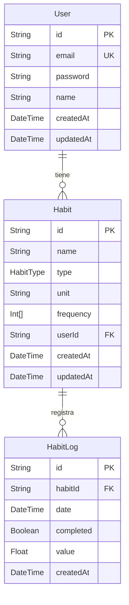

# Arquitectura — Base de Datos

## Tabla de contenidos

- [Motor y proveedor](#motor-y-proveedor)
- [Diagrama entidad-relación](#diagrama-entidad-relación)
- [Modelos](#modelos)
- [Decisiones de diseño](#decisiones-de-diseño)

---

## Motor y proveedor

| Ítem | Detalle |
|------|---------|
| Motor | PostgreSQL |
| Proveedor | Supabase |
| Conexión app | Session Pooler — `pooler.supabase.com:5432` (IPv4 compatible) |
| ORM | Prisma 7.8.0 |
| Configuración CLI | `prisma.config.ts` (patrón Prisma 7 — URL fuera del schema) |

---

## Diagrama entidad-relación

---

## Modelos

### User

Representa a un usuario registrado en la aplicación.

| Campo | Tipo | Restricciones | Descripción |
|-------|------|--------------|-------------|
| `id` | `String` | PK, cuid | Identificador único |
| `email` | `String` | Unique | Email usado para login |
| `password` | `String` | — | Hash bcrypt de la contraseña |
| `name` | `String?` | Opcional | Nombre del usuario |
| `createdAt` | `DateTime` | Default now() | Fecha de registro |
| `updatedAt` | `DateTime` | Auto-update | Última modificación |

---

### Habit

Representa un hábito creado por un usuario.

| Campo | Tipo | Restricciones | Descripción |
|-------|------|--------------|-------------|
| `id` | `String` | PK, cuid | Identificador único |
| `name` | `String` | — | Nombre descriptivo del hábito |
| `type` | `HabitType` | Enum | `BINARY` o `NUMERIC` |
| `unit` | `String?` | Opcional | Unidad de medida (solo `NUMERIC`) |
| `frequency` | `Int[]` | — | Días activos: 0=Dom, 1=Lun … 6=Sáb |
| `userId` | `String` | FK → User | Propietario del hábito |
| `createdAt` | `DateTime` | Default now() | Fecha de creación |
| `updatedAt` | `DateTime` | Auto-update | Última modificación |

> **Cascade:** eliminar un `User` elimina todos sus `Habit` automáticamente.

---

### HabitLog

Registro diario de cumplimiento de un hábito. Máximo uno por hábito por día.

| Campo | Tipo | Restricciones | Descripción |
|-------|------|--------------|-------------|
| `id` | `String` | PK, cuid | Identificador único |
| `habitId` | `String` | FK → Habit | Hábito al que pertenece |
| `date` | `DateTime` | `@db.Date` | Fecha del registro (sin hora) |
| `completed` | `Boolean` | Default false | Si fue completado ese día |
| `value` | `Float?` | Opcional | Valor numérico (solo `NUMERIC`) |
| `createdAt` | `DateTime` | Default now() | Fecha de creación del registro |

> **Constraint único:** `@@unique([habitId, date])` — previene duplicados por hábito/día.  
> **Cascade:** eliminar un `Habit` elimina todos sus `HabitLog` automáticamente.

---

### Enum HabitType

| Valor | Descripción |
|-------|-------------|
| `BINARY` | Hábito de completado/no completado (ej: meditar, leer) |
| `NUMERIC` | Hábito con valor medible (ej: 8 vasos de agua, 5 km corridos) |

---

## Decisiones de diseño

**`frequency` como `Int[]`**
Almacena los días de la semana activos como array de enteros en vez de 7 columnas booleanas separadas. Es más flexible, fácil de iterar y reduce el número de columnas del modelo.

**`date` con `@db.Date`**
El campo usa el tipo `Date` puro de PostgreSQL (sin hora ni timezone). Esto evita problemas de zona horaria al comparar fechas — un log del "18 de mayo" es siempre el 18 de mayo independientemente del timezone del servidor.

**cuid como PK**
Más seguro que auto-increment para IDs expuestos en URLs. Los cuid no son secuenciales, lo que dificulta la enumeración de recursos por parte de actores externos.

**Cascade deletes**
Se configuró `onDelete: Cascade` en ambas relaciones. Mantiene la integridad referencial automáticamente sin requerir lógica de limpieza en la capa de aplicación.
