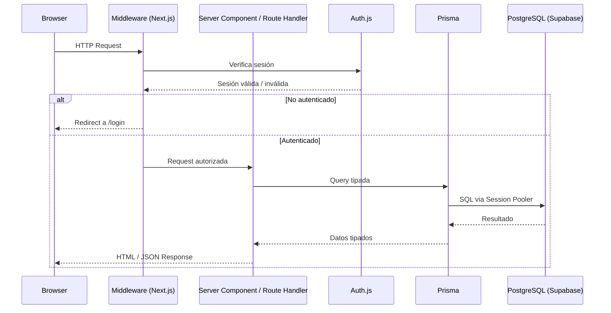

# Arquitectura — Visión General

## Tabla de contenidos

- [Descripción del proyecto](#descripción-del-proyecto)
- [Stack tecnológico](#stack-tecnológico)
- [Estructura del proyecto](#estructura-del-proyecto)
- [Flujo de una request](#flujo-de-una-request)
- [Épicas y funcionalidades](#épicas-y-funcionalidades)
- [Roadmap](#roadmap)

---

## Descripción del proyecto

Habit Maxxing es una aplicación web para el tracking de hábitos diarios. Permite registrar hábitos de tipo binario (completado/no completado) o numérico (con valor medible), visualizar el progreso mediante un calendario heatmap, mantener rachas de cumplimiento y consultar estadísticas mensuales.

El proyecto se desarrolla como ejercicio de aprendizaje cubriendo todas las etapas del ciclo de vida del software: requisitos, backlog, diseño, implementación, testing y deploy.

---

## Stack tecnológico

| Categoría | Tecnología | Versión |
|-----------|-----------|---------|
| Framework | Next.js (App Router) | 16.2.6 |
| Lenguaje | TypeScript | 5.x |
| Estilos | Tailwind CSS | 4.x |
| ORM | Prisma | 7.8.0 |
| Base de datos | PostgreSQL (Supabase) | — |
| Autenticación | Auth.js (NextAuth) | 5.0.0-beta.29 |
| Validación | Zod | 4.4.3 |
| Hash de contraseñas | bcryptjs | 3.0.3 |
| Package manager | pnpm | — |
| Deploy | Vercel | pendiente |

> Ver los ADRs en `docs/architecture/decisions/` para el razonamiento detrás de cada elección.

---

## Estructura del proyecto

```
src/
├── app/                            # App Router de Next.js
│   ├── api/
│   │   └── auth/[...nextauth]/     # Handler dinámico de Auth.js
│   ├── (auth)/                     # Grupo de rutas públicas
│   │   ├── login/page.tsx
│   │   └── register/page.tsx
│   ├── (dashboard)/                # Grupo de rutas protegidas
│   │   └── dashboard/page.tsx
│   ├── layout.tsx                  # Layout raíz (providers globales)
│   └── page.tsx                    # Landing page
├── components/
│   ├── ui/                         # Componentes genéricos reutilizables
│   └── auth/                       # Componentes específicos de autenticación
├── lib/
│   ├── prisma.ts                   # Singleton de PrismaClient
│   ├── auth.ts                     # Configuración de Auth.js
│   └── validations.ts              # Schemas de Zod
├── hooks/                          # Custom hooks de React
└── types/
    └── index.ts                    # Tipos globales de TypeScript

prisma/
├── schema.prisma                   # Modelos de base de datos
├── migrations/                     # Historial de migraciones SQL
└── config.ts → prisma.config.ts   # Configuración Prisma CLI (Prisma 7)
```

---

## Flujo de una request



---

## Épicas y funcionalidades

| ID | Épica | Estado |
|----|-------|--------|
| EP-01 | Autenticación y gestión de cuenta | 🔄 En desarrollo |
| EP-02 | Gestión de hábitos (CRUD) | 🔲 Pendiente |
| EP-03 | Registro diario | 🔲 Pendiente |
| EP-04 | Progreso y estadísticas | 🔲 Pendiente |
| EP-05 | UI/UX responsive y modo oscuro | 🔲 Pendiente |

---

## Roadmap

| Fase | Contenido | Estado |
|------|-----------|--------|
| Fase 1 — MVP | Auth, CRUD hábitos, registro diario, rachas, heatmap | 🔄 En desarrollo |
| Fase 2 | Recordatorios por email, puntos y recompensas | 🔲 Pendiente |
| Fase 3 | Funciones sociales (amigos, logros compartidos) | 🔲 Pendiente |
